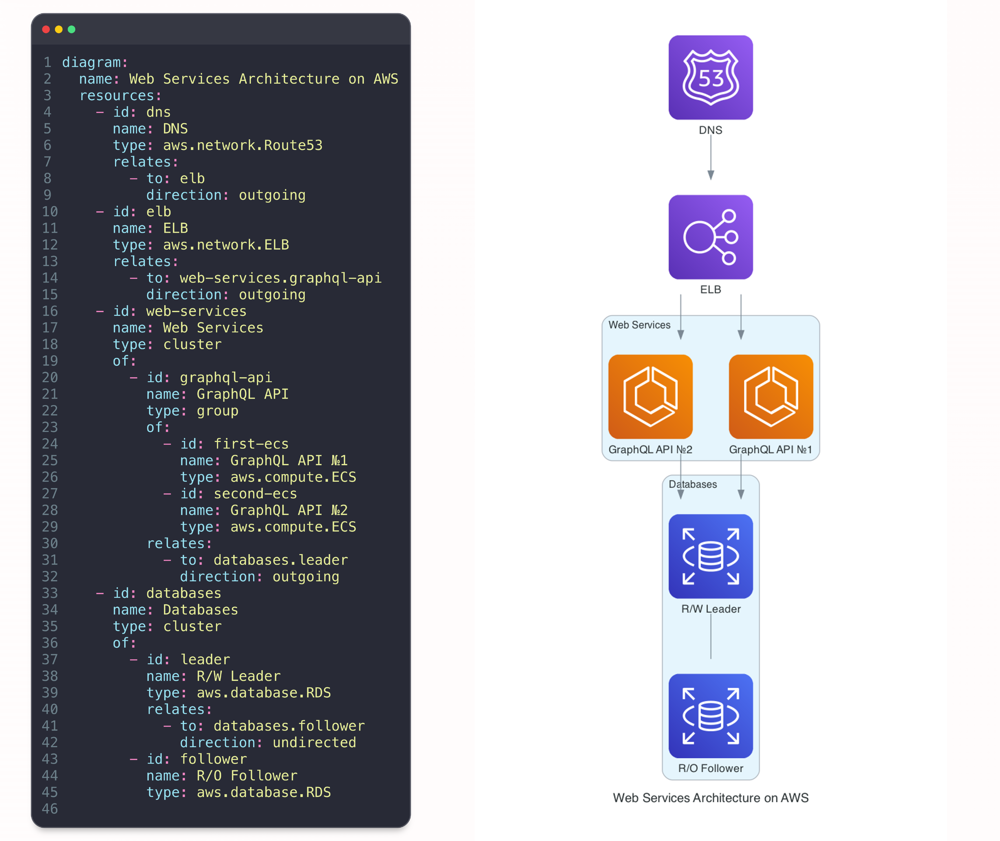
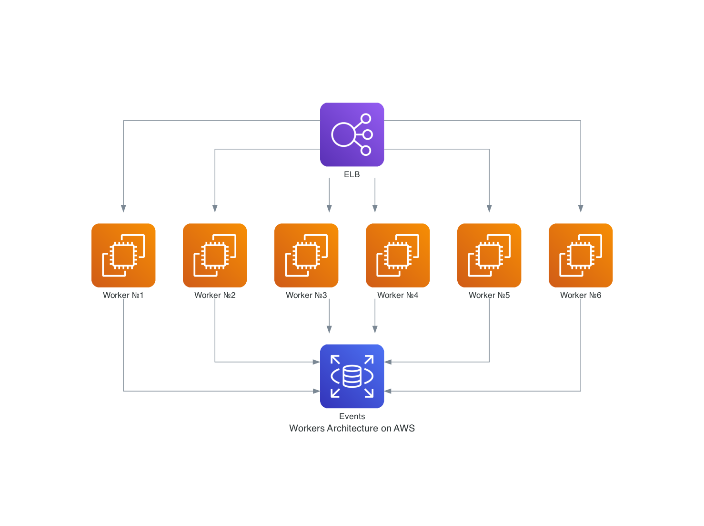
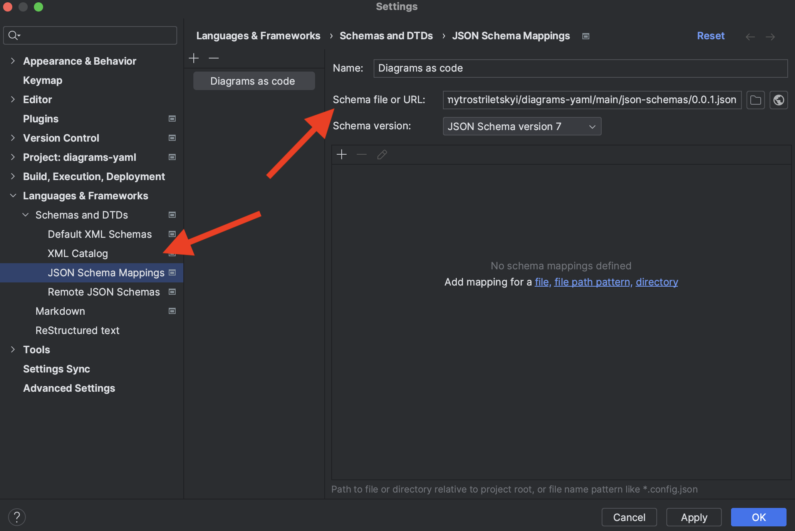
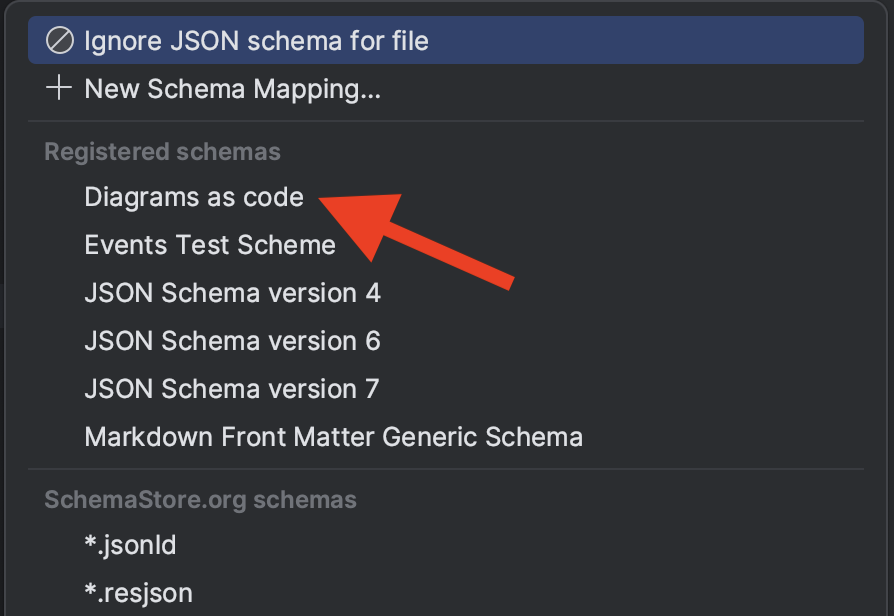
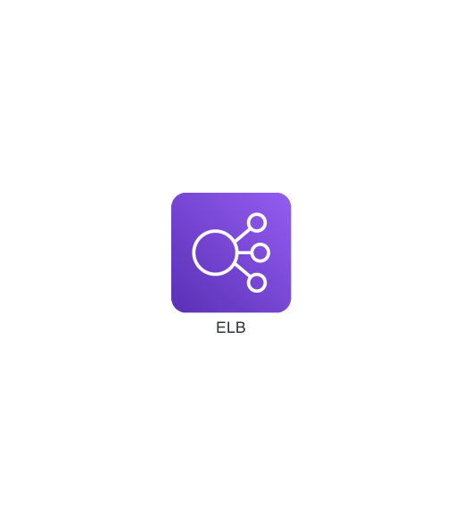
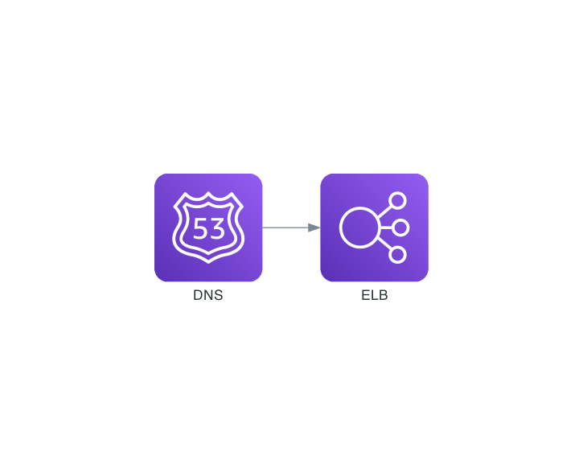
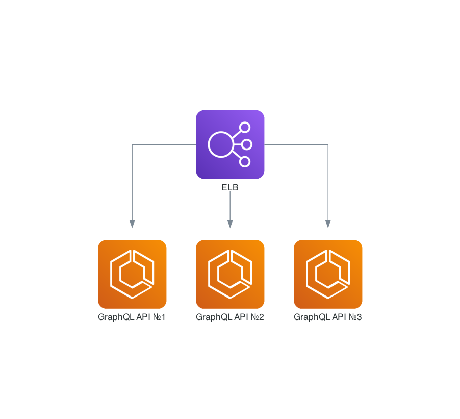
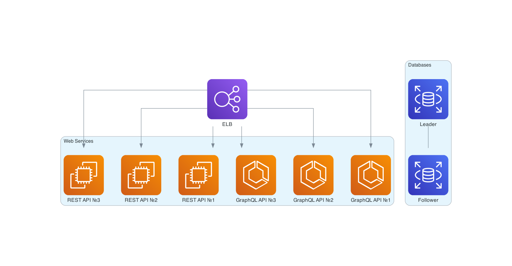

`Diagrams as code`: declarative configurations using `YAML` for drawing cloud system architectures.

[](https://github.com/dmytrostriletskyi/diagrams-yaml/actions/workflows/main.yaml)
[](https://github.com/dmytrostriletskyi/diagrams-yaml/releases)
[](https://pypi.python.org/pypi/diagrams-yaml)
[](https://pypi.python.org/pypi/diagrams-yaml/)
[](https://pypi.python.org/pypi/diagrams-yaml/)



Table of content:

* [Introduction](#introduction)
* [Roadmap](#roadmap)
* [Getting Started](#getting-started)
  * [How to Install](#how-to-install)
  * [Examples](#examples)
  * [Syntax Highlighting](#syntax-highlighting)
    * [PyCharm](#pycharm)
* [Usage](#usage)
  * [Command Line Interface](#command-line-interface)
  * [Guide](#guide)
* [Disclaimer](#disclaimer)

## Introduction

`Diagrams as code` is essentially the process of managing diagrams through code rather than interactively drawing them
on specific web services such as [draw.io](https://app.diagrams.net). It lets you generate the cloud system architecture
in a **declarative** way with widely used `YAML` syntax (which is de facto a standard for infrastructure and 
configurations).

Declarative method of describing things means that a user simply describes the solution they need, how it should look, 
and everything that would be in the state of the final solution, leaving the process for the software to decide.

`Diagrams as code` brings you the following benefits comparing to drawing architecture on your own, it:

* Does not require any knowledge about how to properly draw an architecture diagram. Basically, you just define a set of 
  resources, compose them into groups and set relationships, the rest is done for you.
* Allows you to track an architecture diagram changes with a version control systems such as `Git`.
* Moves collaboration to the next level: updating an architecture diagram through a pull request with a code review 
  instead of a video session and/or screen sharing.
* Reduces costs on further updating of an initial architecture diagram. Basically, when you create an image on a web 
  service you have to eventually store two files: `PNG`-like to put into your documentation and `XML` to be able to 
  adjust your image in the future. So, there is no need to care about `XML` anymore.
* Backups you in case of losing `XML` files as `YAML` files are always stored in a repository.
* Improves consistency as now a diagram is stored along the code in a repository, the place you visit and work on
  frequently, and it is easier to keep it up-to-date.

Currently, the following components are provided:

* Major cloud providers: AWS, Azure, GCP, IBM, Alibaba, Oracle, OpenStack, DigitalOcean and so on.
* On-Premise, Kubernetes, Firebase, Elastic, SaaS.
* Programming languages and frameworks.

## Roadmap

* Add support of [C4](https://diagrams.mingrammer.com/docs/nodes/c4).
* Add support of [Custom](https://diagrams.mingrammer.com/docs/nodes/custom).
* Add IDEs plugins and/or web user interface for live editing.
* Add the `JSON Schema` to [Json Schema Store](https://github.com/fox-forks/schemastore).
* Research Confluence integration to update images from the CI-builds directly.
* Research ChatGRT integration.

## Getting Started

### How to install

As the project uses [Graphviz](https://www.graphviz.org) to render the diagram, you need to install it:

* For `Linux` — https://graphviz.gitlab.io/download/#linux
* For `Windows` — https://graphviz.gitlab.io/download/#windows
* For `macOS` — https://graphviz.gitlab.io/download/#mac

After, you can install the project itself with the following command using `pip3`:

```bash
$ pip3 install diagrams-yaml
```

### Examples

You can find examples of `YAML` configurations in the [examples](https://github.com/dmytrostriletskyi/diagrams-yaml/tree/main/examples) 
folder. Below are placed are few of them (click on the name to redirect to the configurations file).

| [Web Services on AWS](https://github.com/dmytrostriletskyi/diagrams-yaml/blob/main/examples/web-services-aws.yaml)                | [Web Services On-Premise](https://github.com/dmytrostriletskyi/diagrams-yaml/blob/main/examples/web-services-on-premise.yaml)                | [Exposed Pods on Kubernetes](https://github.com/dmytrostriletskyi/diagrams-yaml/blob/main/examples/exposed-pods-kubernetes.yaml)                |
|-----------------------------------------------------------------------------------------------------------------------------------|----------------------------------------------------------------------------------------------------------------------------------------------|-------------------------------------------------------------------------------------------------------------------------------------------------|
|                                                                                 |                                                                                        |                                                                                        |

| [Message Collecting on GCP](https://github.com/dmytrostriletskyi/diagrams-yaml/blob/main/examples/message-collecting-gcp.yaml)    | [Events Processing on AWS](https://github.com/dmytrostriletskyi/diagrams-yaml/blob/main/examples/events-processing-aws.yaml)                 | [Workers on AWS](https://github.com/dmytrostriletskyi/diagrams-yaml/blob/main/examples/workers-aws.yaml)                                        |
| --------------------------------------------------------------------------------------------------------------------------------- | -------------------------------------------------------------------------------------------------------------------------------------------- | ----------------------------------------------------------------------------------------------------------------------------------------------- |
|                                                                           |                                                                                                    |                                                                                                    |

### Syntax Highlighting

When you will be writing your own `YAML` files, you likely need a syntax highlighting. Currently, there is no mapping
of the `YAML` files to a specific schema to enable the syntax highlighting automatically. So, there is a need for
manual operation here.

#### PyCharm

For `PyCharm`, open the settings and proceed to `Languages & Framworks`, then to `Scheams and DTDs`, then to
`JSON Schema Mappings`. After, create a new schema, name it `Diagrams as code`, choose
`JSON Schema version 7`, paste `https://raw.githubusercontent.com/dmytrostriletskyi/diagrams-yaml/main/json-schemas/0.0.1.json`
to the `Schema file or URL` field and click `Apply`:

<details>
  <summary>Open Illustration</summary>

  
</details>

Right after then, open a `YAML` file and click on `No JSON schema` at to bottom-right corner:

<details>
  <summary>Open Illustration</summary>

  
</details>

It will open a panel where you can choose the newly created schema with name `Diagrams as code`:

<details>
  <summary>Open Illustration</summary>

  
</details>

As the result, you will experience the syntax highlighting when typing:

<details>
  <summary>Open Illustration</summary>

  
</details>

## Usage

### Command Line Interface

To draw an architecture, call `diagrams-yaml` command line interface, providing a path to a `YAML` file with 
configurations. The drawing will be saved in the folder the command line interface was executed from.

```bash
$ diagrams-yaml examples/web-services-aws.yaml
```

### Guide

Please, check [all-fields.yaml](./examples/all-fields.yaml) as the example to see all possible configurations
before diving into detailed explanation about them (and [this](./assets/all-fields.jpg) is the result image).

A `YAML` file conceptually contains two configurations: generic information such as name of a diagram, format of an 
image to be generated, style and resources themselves such as `AWS` and `Kubernetes` resources, `Nginx`, `ElasticSearch`
and all other things you actually want to draw, and relationships among them.

```yaml
diagram:
  name: Web Services Architecture on AWS
  file_name: web-services-architecture-aws
  format: jpg
  direction: left-to-right
  style:
    graph:
      splines: ortho
    node:
      shape: circle
    edge:
      color: '#000000'
  label_resources: false
  open: true
  resource:
    ...
```

Generic information schema looks like:

| Field             | Type    | Required | Restrictions                                                        | Default         | Description                                                            |
|-------------------|---------|----------|---------------------------------------------------------------------|-----------------|------------------------------------------------------------------------|
| `name`            | String  | Yes      | -                                                                   | `PNG`           | A name of the diagram which is shown in the image.                     |
| `file_name`       | String  | No       | -                                                                   | -               | A file name of the image that would be created.                        |
| `format`          | String  | No       | `png`, `jpg`, `svg`, `pdf`, `dot`                                   | `png`           | A format of the image that would be created.                           |
| `direction`       | String  | No       | `left-to-right`, `right-to-left`, `top-to-bottom`, `bottom-to-top`  | `left-to-right` | A direction of the diagram's resource.                                 |
| `style`           | Object  | No       | -                                                                   | -               | Style of the diagram.                                                  |
| `label_resources` | Boolean | No       | -                                                                   | `false`         | Whether to label the diagram's resources such as `EC2` or `PodConfig`. |
| `open`            | Boolean | No       | -                                                                   | `false`         | Whether to open the diagram's image after creating it.                 |
| `resources`       | List    | Yes      | -                                                                   | -               | Resources of the diagram.                                              |

`style` is responsible for styling overall diagram such as a background color or choosing between curvy or straight 
arrows. It should go as a nested object of parameters as key/value of [Graphviz's attributes](https://graphviz.org/doc/info/attrs.html). 

Its schema looks like:

| Field   | Type   | Required | Restrictions                                                      | Default | Description      |
|---------|--------|----------|-------------------------------------------------------------------|---------|------------------|
| `graph` | Object | No       | [This](https://graphviz.org/docs/graph/) parameters as key/value. | -       | A graph styling. |
| `node`  | Object | No       | [This](https://graphviz.org/docs/nodes/) parameters as key/value. | -       | A node styling   |
| `edge`  | Object | No       | [This](https://graphviz.org/docs/edges/) parameters as key/value. | -       | An edge styling. |

`resources` is responsible for specifying a list of resources on a diagram and relationships among them. Each resource
has a unique identifier, name and type. Name will be shown on a diagram under the specific resource:

```yaml
diagram:
  resources:
    - id: elb
      name: ELB
      type: aws.network.ELB
```

<details>
  <summary>Open Illustration</summary>

  
</details>

Identifier will be used by other resources to set a relationship direction's type among them:

```yaml
diagram:
  resources:
    - id: dns
      name: DNS
      type: aws.network.Route53
      relates:
        - to: elb
          direction: outgoing
    - id: elb
      name: ELB
      type: aws.network.ELB
```

<details>
  <summary>Open Illustration</summary>

  
</details>

There is also a type named `group`. It is not a specific resource, it is rather a group **of** resources. It is needed
for other resource to be able to have a relationship to all group's resources at once. Each group's resource can can
separate relationships as well:

```yaml
diagram:
  resources:
    - id: elb
      name: ELB
      type: aws.network.ELB
      relates:
        - to: graphql-api
          direction: outgoing
    - id: graphql-api
      name: GraphQL API
      type: group
      of:
        - id: first-api
          name: GraphQL API №1
          type: aws.compute.ECS
        - id: second-api
          name: GraphQL API №2
          type: aws.compute.ECS
        - id: third-api
          name: GraphQL API №3
          type: aws.compute.ECS
```

<details>
  <summary>Open Illustration</summary>

  
</details>

There is also a type named `cluster`. It is needed to separate multiple resources or groups logically: for instance,
there might be a cluster of different APIs composed as groups, a cluster of databases and a cluster of caches.

> Pay attention that to refer a cluster resource, there are the following identifiers `web-services.graphql-api` and 
> `web-services.rest-api` what means that you need to chain identifiers of nested resources through a dot to identify a 
> resource you build a relationship to.

```yaml
diagram:
  resources:
    - id: elb
      name: ELB
      type: aws.network.ELB
      relates:
        - to: web-services.graphql-api
          direction: outgoing
        - to: web-services.rest-api
          direction: outgoing
    - id: web-services
      name: Web Services
      type: cluster
      of:
        - id: graphql-api
          name: GraphQL API
          type: group
          of:
            - id: first-api
              name: GraphQL API №1
              type: aws.compute.ECS
            - id: second-api
              name: GraphQL API №2
              type: aws.compute.ECS
            - id: third-api
              name: GraphQL API №3
              type: aws.compute.ECS
        - id: rest-api
          name: REST API
          type: group
          of:
            - id: first-api
              name: REST API №1
              type: aws.compute.EC2
            - id: second-api
              name: REST API №2
              type: aws.compute.EC2
            - id: third-api
              name: REST API №3
              type: aws.compute.EC2
    - id: databases
      name: Databases
      type: cluster
      of:
        - id: leader
          name: Leader
          type: aws.database.RDS
          relates:
            - to: databases.follower
              direction: undirected
        - id: follower
          name: Follower
          type: aws.database.RDS
```

<details>
  <summary>Open Illustration</summary>

  
</details>

Basically, to recap and also clarify:

* There are resources, groups (of resources or other groups) and clusters (of resources, groups or other clusters).
* You can build a relationship between resource to resource and resource to group (and vice versa), it is impossible to
  relate to a cluster.
* You should chain identifiers of nested resources through a dot to identify a resource you build a relationship to.

`rsources` schema looks like:

| Field     | Type   | Required | Restrictions                                                                                     | Default | Description                              |
|-----------|--------|----------|--------------------------------------------------------------------------------------------------|---------|------------------------------------------|
| `id`      | String | Yes      | -                                                                                                | -       | A unique identifier of the resource.     |
| `name`    | String | Yes      | -                                                                                                | -       | A name of the resource.                  |
| `type`    | String | Yes      | One of the [those](https://github.com/dmytrostriletskyi/diagrams-yaml/tree/main/docs/resources). | -       | A type of the resource.                  |
| `relates` | Object | No       | -                                                                                                | -       | A relationship to a resource or a group. |

This is the table of all available types by a category:

| Name          | Docs                                                  |
|---------------|-------------------------------------------------------|
| Alibaba Cloud | [alibaba_cloud.md](./docs/resources/alibaba_cloud.md) |
| AWS           | [aws.md](./docs/resources/aws.md)                     |
| Azure         | [azure.md](./docs/resources/azure.md)                 |
| DigitalOcean  | [digital_ocean.md](./docs/resources/digital_ocean.md) |
| Elastic       | [elastic.md](./docs/resources/elastic.md)             |
| Firebase      | [firebase.md](./docs/resources/firebase.md)           |
| Flowchart     | [flowchart.md](./docs/resources/flowchart.md)         |
| GCP           | [gcp.md](./docs/resources/gcp.md)                     |
| Generic       | [generic.md](./docs/resources/generic.md)             |
| IBM           | [ibm.md](./docs/resources/ibm.md)                     |
| Kubernetes    | [kubernetes.md](./docs/resources/kubernetes.md)       |
| OCI           | [oci.md](./docs/resources/oci.md)                     |
| On-Premise    | [on_premise.md](./docs/resources/on_premise.md)       |
| OpenStack     | [open_stack.md](./docs/resources/open_stack.md)       |
| Outscale      | [outscale.md](./docs/resources/outscale.md)           |
| Programming   | [programming.md](./docs/resources/programming.md)     |
| SaaS          | [saas.md](./docs/resources/saas.md)                   |

`relates` schema looks like:

| Field       | Type   | Required | Restrictions                                          | Default   | Description                                               |
|-------------|--------|----------|-------------------------------------------------------|-----------|-----------------------------------------------------------|
| `to`        | String | Yes      | -                                                     | -         | A chain of identifiers to a resource via a dot from root. |
| `direction` | String | Yes      | `incoming`, `outgoing`, `bidirectional`, `undirected` | -         | A direction of a relationship.                            |
| `label`     | String | No       | -                                                     | -         | A label of a relationship.                                |
| `color`     | String | No       | `Hexadecimal color` with the `#` symbol.              | `#2D3436` | A color of a relationship.                                |
| `style`     | String | No       | -                                                     | -         | A style of a relationship.                                |

## Disclaimer

`diagrams-yaml` is a wrapper around original [diagrams](https://github.com/mingrammer/diagrams). The original `diagrams` 
lets you draw the cloud system architecture in `Python` code. It was born for prototyping a new system architecture 
design without any design tools. Under the hood, `diagrams-yaml` parse a `YAML` file and map to specific set of 
`diagrams`'s functions and classes, and executes them in proper order.

But you don't have to worry about `diagrams` because `diagrams-yaml` is self-contained and encapsulates it well. 
