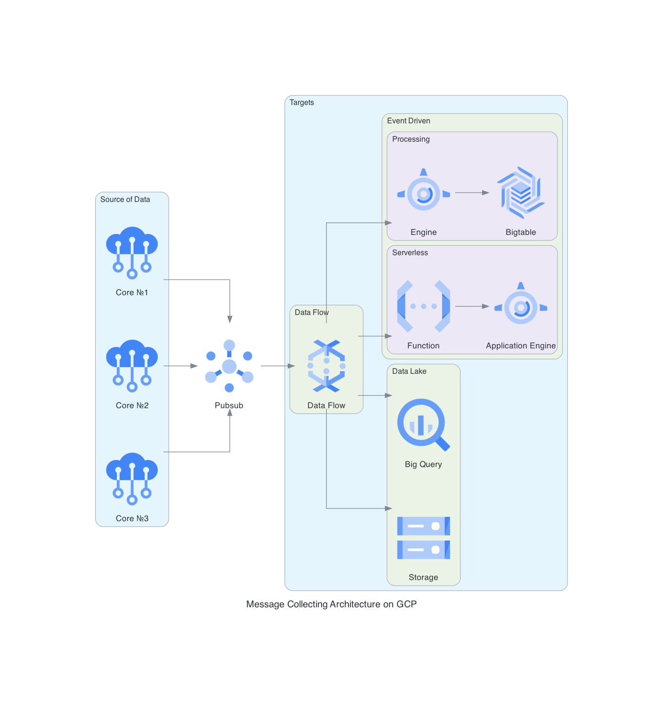

`Diagram as Code` in a declarative way using `YAML` for drawing cloud system architectures.

[](https://github.com/dmytrostriletskyi/diagrams-yaml/actions/workflows/main.yaml)
[](https://github.com/dmytrostriletskyi/diagrams-yaml/releases)
[](https://pypi.python.org/pypi/diagrams-yaml)
[](https://pypi.python.org/pypi/diagrams-yaml/)
[](https://pypi.python.org/pypi/diagrams-yaml/)


Table of content:

* [Introduction](#introduction)
* [Getting Started](#getting-started)
  * [How to Install](#how-to-install)
  * [Examples](#examples)
  * [Usage](#usage)
* [Disclaimer](#disclaimer)

## Introduction

This project lets you draw the cloud system architecture in a declarative way with widely used `YAML` syntax which is de 
facto a standard for infrastructure and configurations so here habitual approaches are met and industry best practices
are aligned as well. It allows you to track an architecture's diagram changes with a version control system such as 
`Git`.

Currently, the following components are provided:

* Major cloud providers: AWS, Azure, GCP, IBM, Alibaba, Oracle, OpenStack, DigitalOcean and so on.
* On-Premise, Kubernetes, Firebase, Elastic, SaaS.
* Programming languages and frameworks.
* And other generic things such as C4.

Basically, with the project, you just define set of resources, compose them into groups and/or clusters and set 
relationships, anything else is done under the hood.

## Getting Started

### How to install

As the project uses [Graphviz](https://www.graphviz.org) to render the diagram, you need to install it:

* For `Linux` — https://graphviz.gitlab.io/download/#linux
* For `Windows` — https://graphviz.gitlab.io/download/#windows
* For `macOS` — https://graphviz.gitlab.io/download/#mac

After, you can install the project itself with the following command using `pip3`:

```bash
$ pip3 install diagrams-yaml
```

### Examples

You can find examples of `YAML` configurations in the [examples](https://github.com/dmytrostriletskyi/diagrams-yaml/tree/main/examples) 
folder. Below are placed are few of them (click on the name to redirect to the configurations file).

| [Web Services on AWS](https://github.com/dmytrostriletskyi/diagrams-yaml/blob/main/examples/web-services-aws.yaml)                | [Web Services On-Premise](https://github.com/dmytrostriletskyi/diagrams-yaml/blob/main/examples/web-services-on-premise.yaml)                | [Exposed Pods on Kubernetes](https://github.com/dmytrostriletskyi/diagrams-yaml/blob/main/examples/exposed-pods-kubernetes.yaml)                |
|-----------------------------------------------------------------------------------------------------------------------------------|----------------------------------------------------------------------------------------------------------------------------------------------|-------------------------------------------------------------------------------------------------------------------------------------------------|
|                                                                                 |                                                                                        |                                                                                        |

| [Message Collecting on GCP](https://github.com/dmytrostriletskyi/diagrams-yaml/blob/main/examples/message-collecting-gcp.yaml)    | [Events Processing on AWS](https://github.com/dmytrostriletskyi/diagrams-yaml/blob/main/examples/events-processing-aws.yaml)                 | [Workers on AWS](https://github.com/dmytrostriletskyi/diagrams-yaml/blob/main/examples/workers-aws.yaml)                                        |
| --------------------------------------------------------------------------------------------------------------------------------- | -------------------------------------------------------------------------------------------------------------------------------------------- | ----------------------------------------------------------------------------------------------------------------------------------------------- |
|                                                                           |                                                                                                    |                                                                                                    |

### Usage

To draw an architecture, call `diagrams-yaml` command line interface, providing a path to a `YAML` file with 
configurations:

```bash
$ diagrams-yaml examples/web-services-aws.yaml
```

The drawing will be saved in the folder the command line interface was executed from:

```bash
$ ls
├── ...
└── web-services-aws.png
```

## Disclaimer

`diagrams-yaml` is a wrapper around original [diagrams](https://github.com/mingrammer/diagrams). The original `diagrams` 
lets you draw the cloud system architecture in `Python` code. It was born for prototyping a new system architecture 
design without any design tools. Under the hood, `diagrams-yaml` parse a `YAML` file and map to specific set of 
`diagrams`'s functions and classes, and executes them in proper order.

But you don't have to worry about `diagrams` because `diagrams-yaml` is self-contained and encapsulates it well. 
